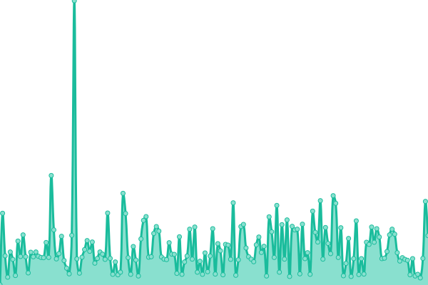
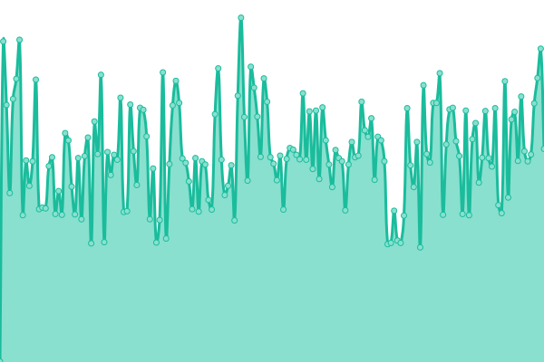
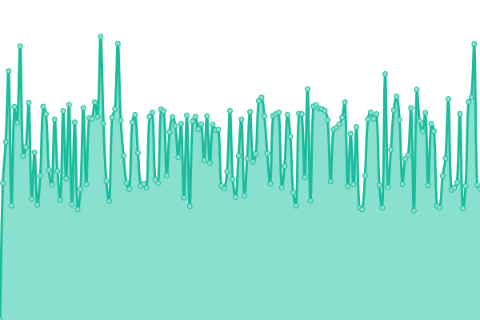
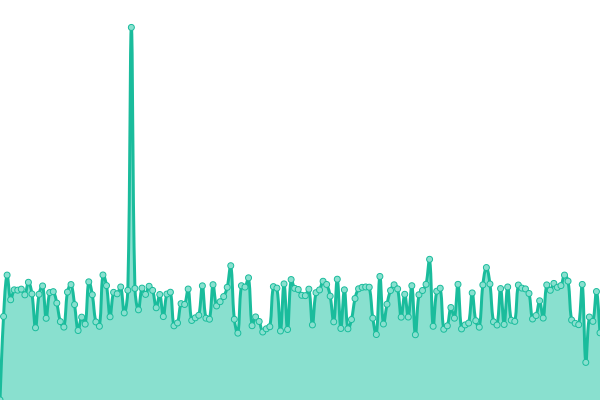
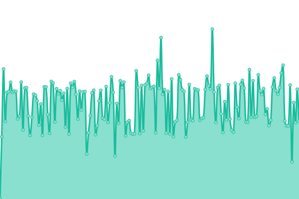
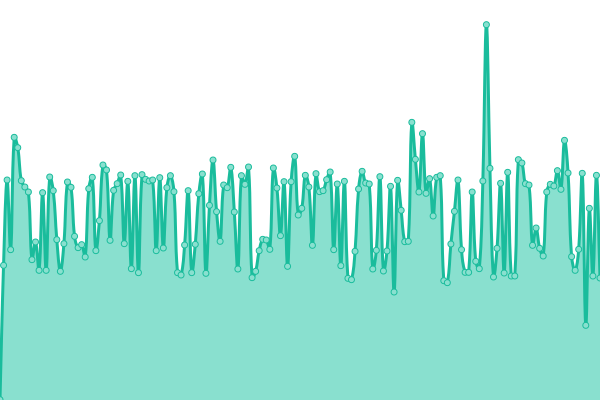
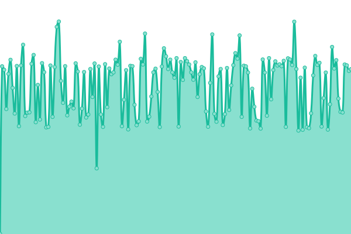
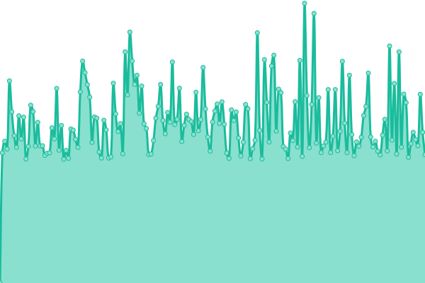
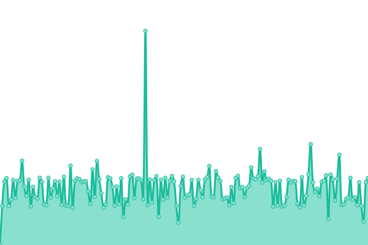
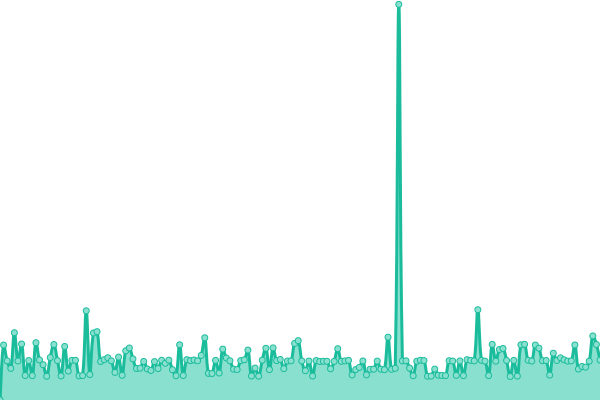

# [📈 Live Status](https://status.labs.ie): <!--live status--> **🟩 All systems operational**

This repository contains the open-source uptime monitor and status page for [jamiew0w](jamie.ie), powered by [Upptime](https://github.com/upptime/upptime).

With [Upptime](https://upptime.js.org), you can get your own unlimited and free uptime monitor and status page, powered entirely by a GitHub repository. We use [Issues](https://github.com/jamiew0w/status.labs.ie/issues) as incident reports, [Actions](https://github.com/jamiew0w/status.labs.ie/actions) as uptime monitors, and [Pages](https://status.labs.ie) for the status page.

<!--start: status pages-->
<!-- This summary is generated by Upptime (https://github.com/upptime/upptime) -->
<!-- Do not edit this manually, your changes will be overwritten -->
<!-- prettier-ignore -->
| URL | Status | History | Response Time | Uptime |
| --- | ------ | ------- | ------------- | ------ |
|  [labs.ie](https://labs.ie) | 🟩 Up | [labs-ie.yml](https://github.com/jamiew0w/status.labs.ie/commits/HEAD/history/labs-ie.yml) | 

 175ms
     
 | 

<a href="https://status.labs.ie/history/labs-ie">100.00%</a>
    

|  [git.labs.ie](https://git.labs.ie) | 🟩 Up | [git-labs-ie.yml](https://github.com/jamiew0w/status.labs.ie/commits/HEAD/history/git-labs-ie.yml) | 

 606ms
     
 | 

<a href="https://status.labs.ie/history/git-labs-ie">100.00%</a>
    

|  [grafana.labs.ie](https://grafana.labs.ie) | 🟩 Up | [grafana-labs-ie.yml](https://github.com/jamiew0w/status.labs.ie/commits/HEAD/history/grafana-labs-ie.yml) | 

 1522ms
     
 | 

<a href="https://status.labs.ie/history/grafana-labs-ie">100.00%</a>
    

|  [help.labs.ie](https://help.labs.ie) | 🟩 Up | [help-labs-ie.yml](https://github.com/jamiew0w/status.labs.ie/commits/HEAD/history/help-labs-ie.yml) | 

 1206ms
     
 | 

<a href="https://status.labs.ie/history/help-labs-ie">100.00%</a>
    

|  [huginn.labs.ie](https://huginn.labs.ie) | 🟩 Up | [huginn-labs-ie.yml](https://github.com/jamiew0w/status.labs.ie/commits/HEAD/history/huginn-labs-ie.yml) | 

 737ms
     
 | 

<a href="https://status.labs.ie/history/huginn-labs-ie">100.00%</a>
    

|  [jenkins.labs.ie](https://jenkins.labs.ie) | 🟩 Up | [jenkins-labs-ie.yml](https://github.com/jamiew0w/status.labs.ie/commits/HEAD/history/jenkins-labs-ie.yml) | 

 711ms
     
 | 

<a href="https://status.labs.ie/history/jenkins-labs-ie">100.00%</a>
    

|  [nc.labs.ie](https://nc.labs.ie) | 🟩 Up | [nc-labs-ie.yml](https://github.com/jamiew0w/status.labs.ie/commits/HEAD/history/nc-labs-ie.yml) | 

 1445ms
     
 | 

<a href="https://status.labs.ie/history/nc-labs-ie">100.00%</a>
    

|  [paste.labs.ie](https://paste.labs.ie) | 🟩 Up | [paste-labs-ie.yml](https://github.com/jamiew0w/status.labs.ie/commits/HEAD/history/paste-labs-ie.yml) | 

 682ms
     
 | 

<a href="https://status.labs.ie/history/paste-labs-ie">100.00%</a>
    

|  [zabbix.labs.ie](https://zabbix.labs.ie) | 🟩 Up | [zabbix-labs-ie.yml](https://github.com/jamiew0w/status.labs.ie/commits/HEAD/history/zabbix-labs-ie.yml) | 

 596ms
     
 | 

<a href="https://status.labs.ie/history/zabbix-labs-ie">100.00%</a>
    

|  [znc.labs.ie](https://znc.labs.ie) | 🟩 Up | [znc-labs-ie.yml](https://github.com/jamiew0w/status.labs.ie/commits/HEAD/history/znc-labs-ie.yml) | 

 506ms
     
 | 

<a href="https://status.labs.ie/history/znc-labs-ie">100.00%</a>
    

<!--end: status pages-->

[**Visit our status website →**](https://status.labs.ie)

## 📄 License

- Powered by: [Upptime](https://github.com/upptime/upptime)
- Code: [MIT](./LICENSE) © [jamiew0w](jamie.ie)
- Data in the `./history` directory: [Open Database License](https://opendatacommons.org/licenses/odbl/1-0/)
